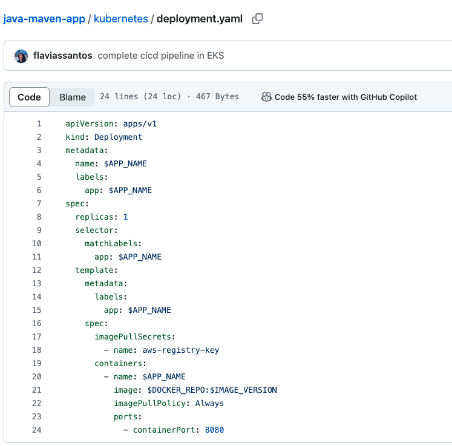
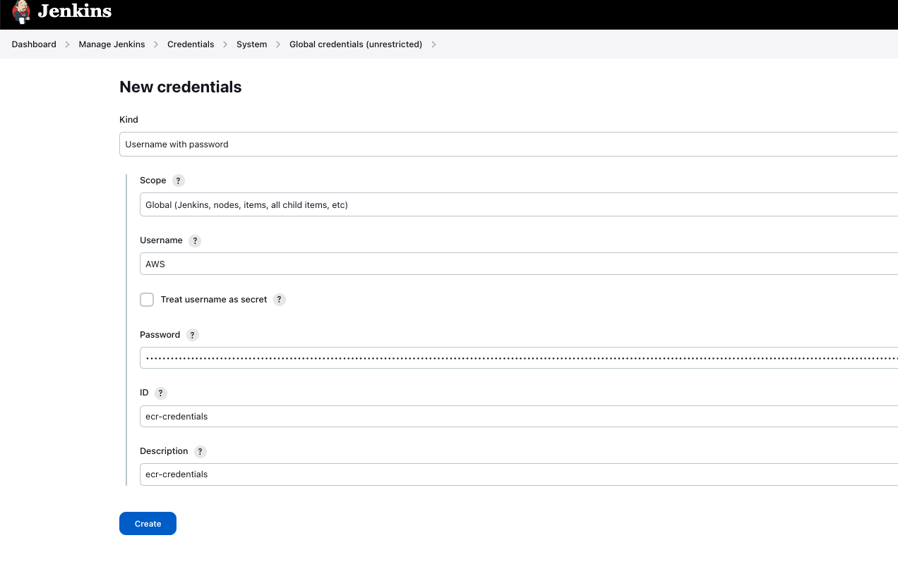
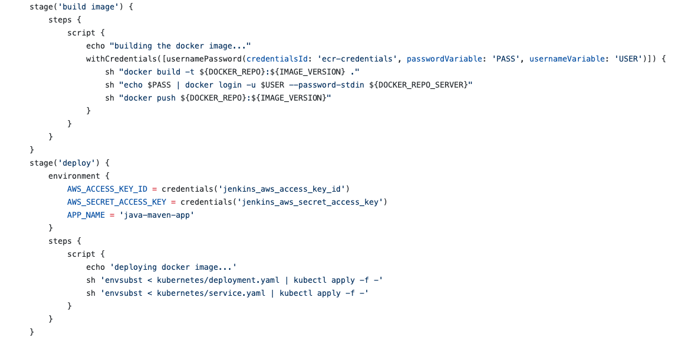
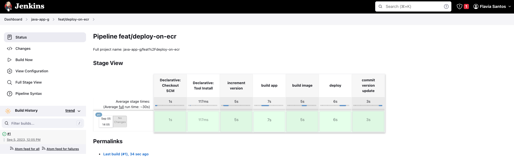
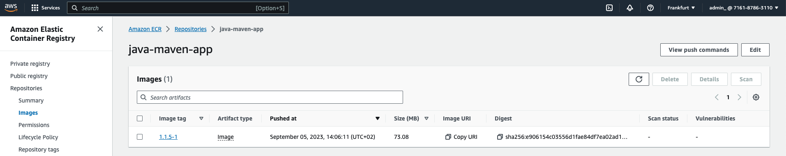

# Project Capstone 1 - Complete CI/CD Pipeline with EKS and AWS ECR

#### Technologies used:

Kubernetes, Jenkins, AWS EKS, AWS ECR, Java, Maven, Linux, Docker, Git

#### Gihub repos:

[Jenkins Shared Library](https://github.com/flaviassantos/jenkins-shared-library)

[Java Maven app](https://github.com/flaviassantos/java-maven-app/tree/feat/deploy-on-ecr)

In this project, I've successfully set up a private AWS Elastic Container Registry (ECR) Docker repository, enhancing the security and control of our container images. I've seamlessly integrated this private repository into my CI/CD pipeline, creating a robust and efficient deployment process.

To achieve this, I made critical adjustments to the Jenkinsfile, enabling it to build Docker images and push them to the AWS ECR registry. This integration ensures that my container images are securely stored and easily accessible for deployment.

Additionally, I've extended the CI/CD pipeline to include the deployment of our applications to a Kubernetes (K8s) cluster, directly from the AWS ECR private registry. This end-to-end configuration streamlines my development and deployment workflow, enhancing efficiency and reliability.

---

## Project Description:

1. **Project Introduction**:
   - To start, I embarked on a project to seamlessly integrate Kubernetes deployment into our CI/CD pipeline.

2. **Understanding the Existing Pipeline**:
   - First, I took a close look at our current CI/CD pipeline. It covers version incrementation, application building, Docker image creation, and a vacant deploy stage.

3. **Creating Kubernetes Configuration Files**:
   - We realized the need to prepare Kubernetes configuration files, specifically deployment.yaml and service.yaml, to facilitate the deployment of our application.

4. **Dynamic Image Names and Environmental Variables**:
   - To keep things flexible, we decided to set the image name dynamically, using an environmental variables "$DOCKER_REPO:$IMAGE_VERSION". Additionally, we explored the utility of environmental variables for handling various labels.

5. **Substituting Variables in YAML Files**:
   - I was devised a strategy to inject variable values into the Kubernetes YAML files. This involved using the `envsubst` command to replace placeholders with actual values before applying them using `kubectl apply`.

6. **Installing the `envsubst` Tool**:
   - I took care to install the `envsubst` tool within our Jenkins container, ensuring it was ready to perform the variable substitution as needed.

7. **Setting Up Docker Hub Registry Authentication**:
   - To facilitate image retrieval from our private Docker repository on Docker Hub, I created a Docker Hub registry secret containing the necessary authentication details.

8. **Utilizing the Docker Registry Secret**:
   - With the Docker registry secret in place, I configured our Kubernetes deployment to leverage it, ensuring secure access to the private repository.

9. **Pipeline Execution**:
   - With everything set up, I executed our Jenkins pipeline, witnessing successful completion of stages, including deployment and version updates.

10. **Verification**:
    - To confirm the deployment's success, I verified the running pods and their associated images, ensuring that our project was on the right track.

---

## Project Execution

1. Create private AWS ECR Docker repository, created Credential for ECR repository in Jenkins
and Secret for AWS ECR Registry in EKS cluster and adjusted reference in Deployment file

 
    
    # ecr password:
    aws ecr get-login-password --region eu-central-1
    
    aws ecr get-login-password --region eu-central-1 | kubectl create secret docker-registry aws-registry-key --docker-server=716187863110.dkr.ecr.eu-central-1.amazonaws.com --docker-username=AWS --docker-password=--password-stdin

 

2. Adjust Jenkinsfile to build and push Docker Image to AWS ECR

  

3. Integrate deploying to K8s cluster in the CI/CD pipeline from AWS ECR private registry
So the complete CI/CD project we build has the following configuration:

    - CI step: Increment version
    - CI step: Build artifact for Java Maven application
    - CI step: Build and push Docker image to AWS ECR
    - CD step: Deploy new application version to EKS cluster
    - CD step: Commit the version update

 

 