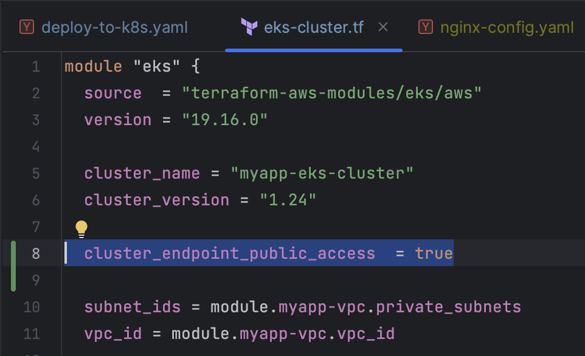
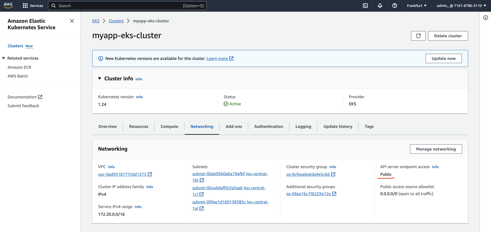
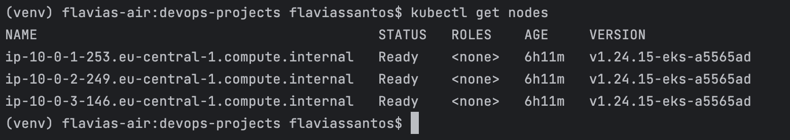
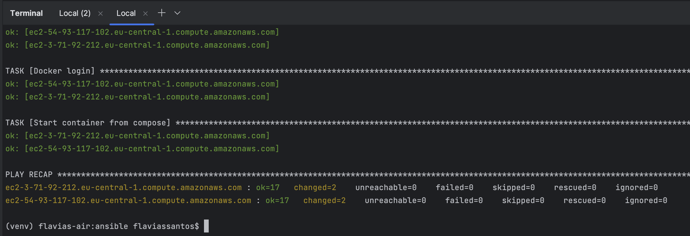
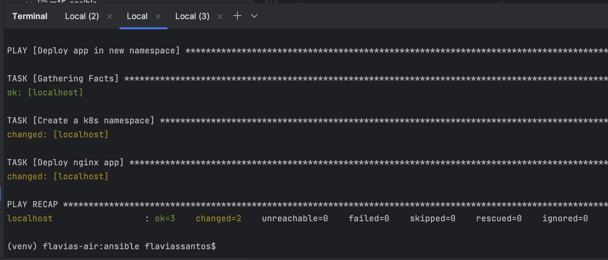
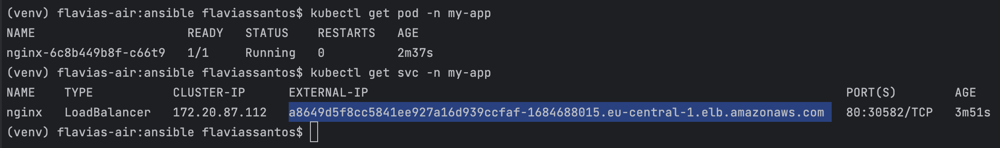
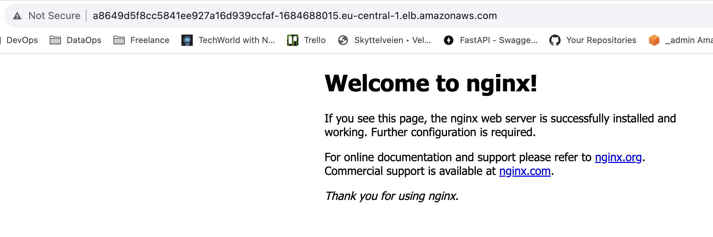

# Capstone Project 2 - Automate Kubernetes Deployment

#### Technologies used:

Ansible, Terraform, Kubernetes, AWS EKS, Python, Linux


In this project, I've accomplished the creation of an Amazon Elastic Kubernetes Service (EKS) cluster using Terraform. This foundational step establishes the Kubernetes infrastructure necessary for deploying and managing containerized applications.

Additionally, I've authored an Ansible Playbook designed to streamline the deployment of our application within a new Kubernetes namespace. This automation ensures a consistent and efficient process for deploying and managing our application within the Kubernetes cluster.

---

## Project Description:

**1: Setting Up the Terraform Infrastructure**
   - In this phase, I shifted my focus to deploying applications into a Kubernetes cluster using Terraform.

**2: Preparing for Kubernetes Deployment**
   - I created a Kubernetes cluster on AWS using a Terraform script that I had previously set up in the Terraform module. This automated the cluster creation process.

**3: Configuring Ansible for Kubernetes Deployment**
   - To connect Ansible to the newly created EKS (Elastic Kubernetes Service) cluster, I needed to ensure Ansible had the necessary configuration.
   - I modified the Terraform script to save a local copy of the kubeconfig file, which contains the cluster's connection details.

**4: Writing Ansible Playbooks**
   - I created an Ansible playbook named "deploy-to-k8s.yaml" to manage the deployment of applications into the Kubernetes cluster.
   - Inside the playbook, I used the "community.kubernetes" Ansible module, which simplifies interactions with Kubernetes clusters.
   - The first task involved creating a Kubernetes namespace ("myapp") using the Kubernetes module, following the structure of Kubernetes configuration files.

**5: Preparing the Environment**
   - I ensured that Ansible had access to the required Python modules, specifically "openshift" and "pyyaml," which are prerequisites for running the Kubernetes module. These modules were installed using pip3.

**6: Executing the Ansible Playbook**
   - I ran the Ansible playbook to create the Kubernetes namespace, utilizing the kubeconfig file saved earlier. This playbook executed locally but connected to the remote Kubernetes cluster.
   - I confirmed the successful creation of the "myapp" namespace using the "kubectl" command.

**7: Deploying an Application**
   - In the same playbook, I added a task to deploy an Nginx application into the "myapp" namespace. Instead of specifying the application configuration directly in the playbook, I referenced a Kubernetes YAML file containing the deployment and service specifications.
   - I used the "kubeconfig" and "namespace" attributes in the playbook to define the context for executing this task.

**8: Verifying the Deployment**
   - After executing the playbook, I verified that the Nginx application was successfully deployed by checking the pods and services within the "myapp" namespace using the "kubectl" command.
   - I also accessed the Nginx application through its AWS-assigned DNS name to confirm its availability.

---

## Project Execution:

Create EKS cluster with Terraform

```
vpc_cidr_block = "10.0.0.0/16"
private_subnet_cidr_blocks = ["10.0.1.0/24", "10.0.2.0/24", "10.0.3.0/24"]
public_subnet_cidr_blocks = ["10.0.4.0/24", "10.0.5.0/24", "10.0.6.0/24"]

```
Write Ansible Play to deploy application in a new K8s
namespace

❏ Terraform - Created K8s cluster

 

  

```
$ kubectl get nodes
```

  

```
$ aws eks update-kubeconfig --name myapp-eks-cluster --region eu-central-1
$ python3 -c "import openshift"
$ export KUBECONFIG=/Users/flaviassantos/github/devops-projects/m12_terraform/terraform/kubeconfig_myapp-eks-cluster
```

See more on aws modules [here](https://registry.terraform.io/modules/terraform-aws-modules/eks/aws/latest#input_cluster_endpoint_public_access).

❏ Written Play “Deploy app in new namespace”

❏ Set kubeconfig environment variable


 
 

```
$ kubectl get pod -n my-app
$ kubectl get svc -n my-app
```

 

   

