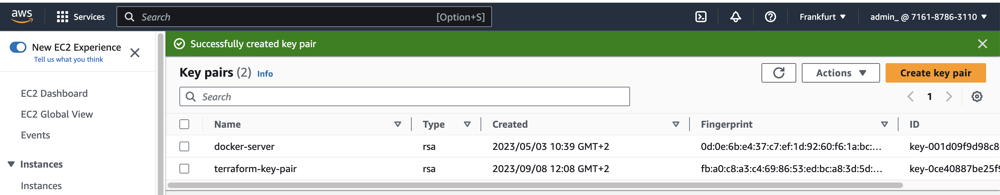
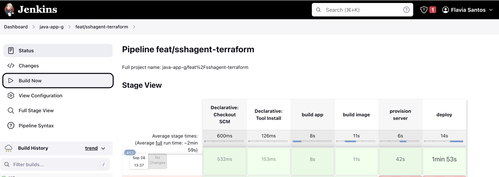

# Capstone Project 3: Complete CI/CD with Terraform

#### Technologies used:

Terraform, Jenkins, Docker, AWS, Git, Java, Maven, Linux, Docker Hub

#### Gihub repos:

[Jenkins Shared Library](https://github.com/flaviassantos/jenkins-shared-library)

[Java Maven app](https://github.com/flaviassantos/java-maven-app/tree/feat/sshagent-terraform)


In this project,  I integrate infrastructure provisioning stage into complete CI/CD Pipeline to automate provisioning server instead of deploying to an existing one.

 

---

## Project Description and Execution:

**Step 1: Set Up Terraform for Server Provisioning**
- I started by preparing to integrate Terraform into the CI/CD pipeline. To do this, I needed to provision a remote server automatically before I deploy the Docker image to it. First, I installed the SSH Agent plugin and created an SSH key pair to securely access the server. 


- I chose to create the key pair ('terraform-key-pair') manually within AWS and downloaded the private key (PEM file). Then, I added this private key to Jenkins as a credential for the 'ec2-user' so that it could be used later.

   

 

**Step 2: Install Terraform in Jenkins**
- To ensure that Terraform was available within the Jenkins environment, I SSHed into my server (Droplet), accessed the Jenkins container as a root user, and installed Terraform inside it. I followed the official HashiCorp guidelines for installing Terraform on my Debian-based distribution. This step allowed me to execute Terraform commands like `terraform init` and `terraform apply` within the Jenkins container.

- [Install Terraform](https://developer.hashicorp.com/terraform/tutorials/aws-get-started/install-cli) inside Jenkins container.

```
  cat etc/os-release 
  apt-get update && apt-get install -y gnupg software-properties-common
  wget -O- https://apt.releases.hashicorp.com/gpg | gpg --dearmor | tee /usr/share/keyrings/hashicorp-archive-keyring.gpg
```

**Step 3: Define Terraform Configuration Files**
- I created Terraform configuration files for provisioning AWS resources, such as VPC, subnets, security groups, and EC2 instances. These configuration files were added to my Java Maven application's codebase under a "terraform" folder, following best practices. Inside the Jenkinsfile, I made adjustments to the "provision server" and "deploy" stages. In the "provision server" stage, I executed `terraform init` and `terraform apply` while setting AWS credentials as environment variables. Additionally, I used Terraform outputs to dynamically retrieve the EC2 instance's public IP address and saved it as an environment variable for use in the deployment stage. 
- To account for potential timing issues during the server initialization process, I added a sleep command to allow the server time to complete its setup before executing subsequent commands.
- These steps ensured the successful integration of Terraform into the CI/CD pipeline, automating server provisioning and improving deployment efficiency:

  - CI step: Build artifact for Java Maven application
  - CI step: Build and push Docker image to Docker Hub
  - CD step: Automatically provision EC2 instance using TF
  - CD step: Deploy new application version on the provisioned EC2 instance with Docker Compose


 

 

 

- Change permissions to the PEM file and SSH into the EC2 instance:

```
chmod 40 ~/Downloads/terraform-key-pair.pem 
ssh -i ~/Downloads/terraform-key-pair.pem ec2-user@3.120.146.233
```

 

**Step 4: Configuring Docker Login for Private Repositories:**

- I added a step in the Jenkinsfile to execute Docker login on the remote EC2 server before running Docker Compose.
- To securely pass Docker Hub credentials, I retrieved them from Jenkins credentials and set them as environment variables.
- This allowed the EC2 server to authenticate with Docker Hub for pulling private images, ensuring the successful deployment of the application.

-   