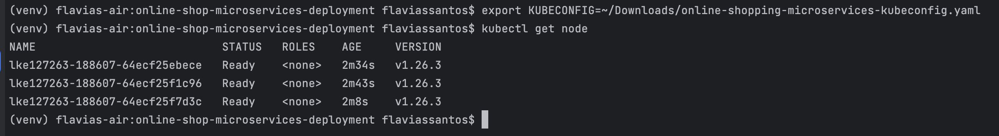
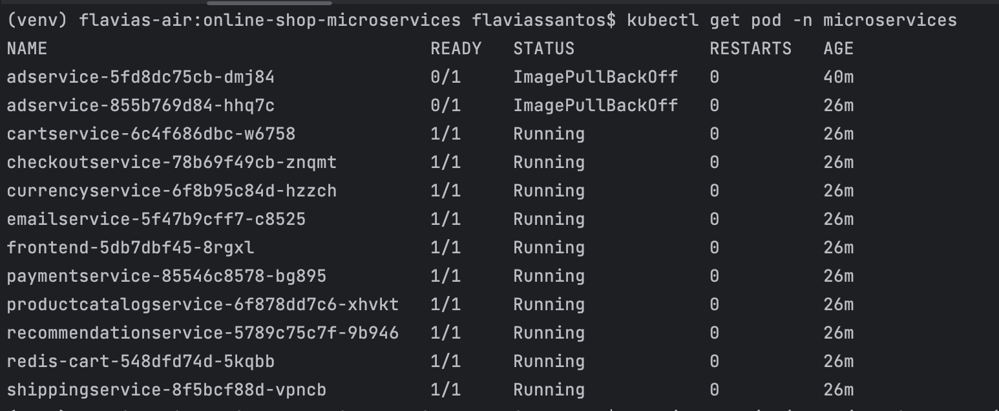
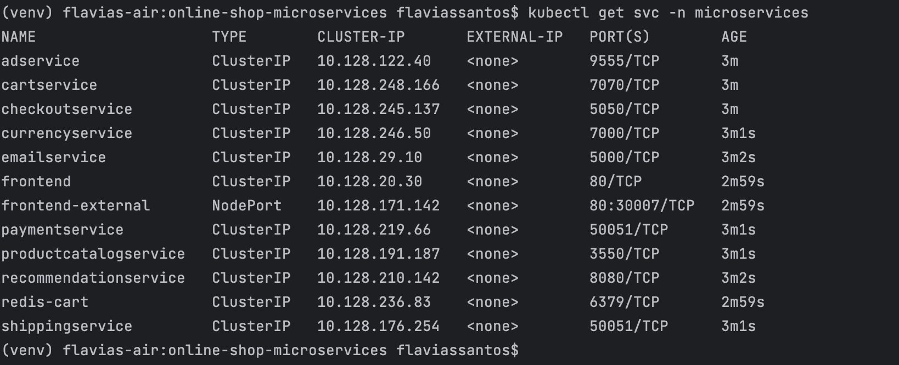
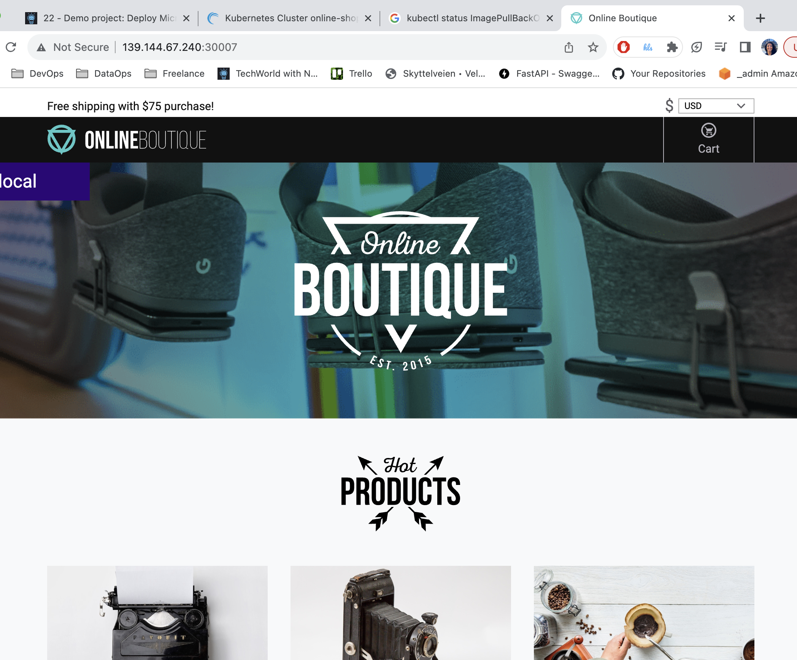

# Capstone Project 4 - Deploy Microservices application in Kubernetes with Production & Security Best Practices

In this project, I successfully accomplished the creation of Kubernetes manifests for the Deployments and Services of all microservices within an online shop application.

#### Technologies used:

Kubernetes, Redis, Linux, Linode LKE

---

## Project Description:

1. **Understanding the Microservices**: I began by reviewing the microservices application, which was an official demo project from Google. Instead of delving into the code details, I focused on understanding the high-level architecture and dependencies between the microservices. I identified which microservices communicate with each other and if any external services or databases were required.

2. **Gathering Information**: To deploy the microservices, we need to collect essential information. This included the names of all the microservices, their image names, the environment variables they expected, and the ports they would use for communication. Developers should inform which microservice served as the entry point for external requests.

3. **Creating Configuration Files**: I created a directory for the microservices deployment and service configuration files. In this directory, I established a YAML configuration file named "config.yaml" to define the deployment and service settings for each microservice.

4. **Configuring Deployments and Services**: Within the "config.yaml" file, I used a standard structure for defining deployments and services for each microservice. This involved specifying the deployment name, container image, ports, and necessary environment variables.

5. **Setting Up Service Endpoints**: For microservices that communicated with other services, I configured environment variables within the YAML file to specify the endpoints of the dependent services. This ensured that each microservice knew how to communicate with the others.

6. **Creating Redis Service**: Since one microservice required Redis as a message broker and temporary database, I created a separate Redis service with an associated volume to store data temporarily in memory.

7. **Deploying the Microservices**: With the configuration file ready, I deployed the microservices to a Kubernetes cluster. I exported the Kubernetes configuration and used it to connect to the cluster.

8. **Verifying Deployments**: I checked the status of the deployed microservices using commands like "kubectl get pods" and "kubectl get services" to ensure that all pods and services were running as expected.

9. **Accessing the Application**: To test the application, I obtained the IP address of one of the worker nodes and accessed the front-end microservice externally through the specified node port (port 30007). This allowed me to confirm that the online shop application was working correctly.

---

## Project Execution:

Create K8s manifests for Deployments and Services for all microservices of an online shop application

```
$ chmod 400 ~/Downloads/online-shopping-microservices-kubeconfig.yaml
$ export KUBECONFIG=~/Downloads/online-shopping-microservices-kubeconfig.yaml
$ kubectl create ns microservices
$ kubectl apply -f config.yaml -n microservices
$ kubectl get svc -n microservices

```


Deploy microservices to Linode’s managed Kubernetes
cluster

  

 

  
