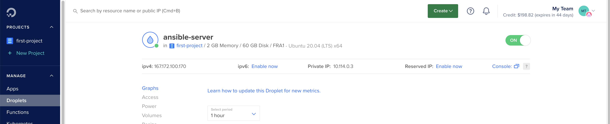
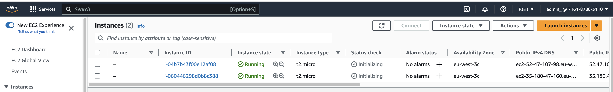
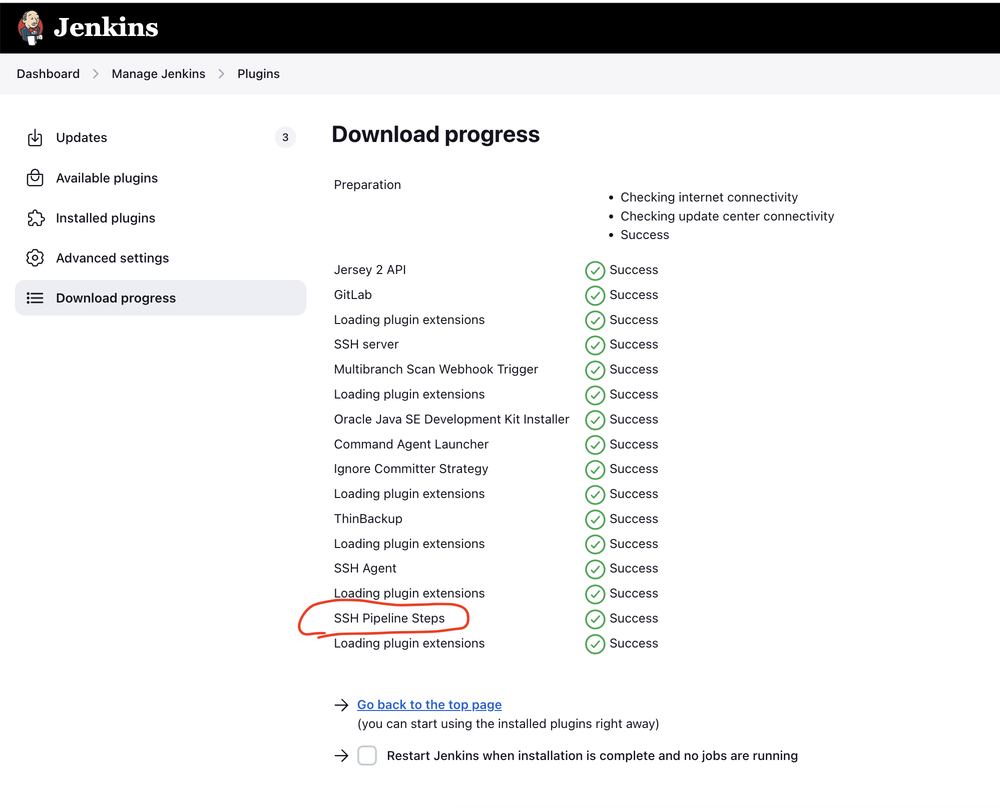
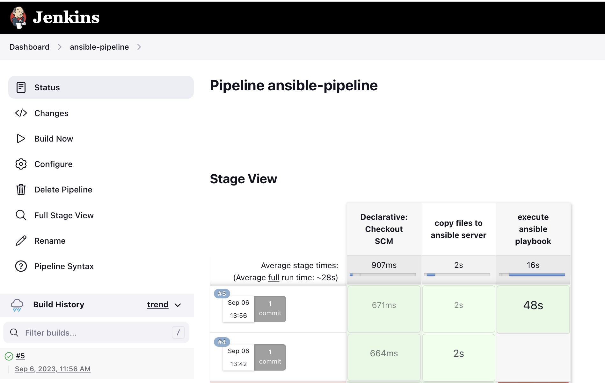

# Capstone Project 5: Ansible Integration in Jenkins

This project allowed me to set up a Jenkins pipeline that securely copied necessary Ansible files to a remote server and executed Ansible playbooks for configuring EC2 instances.

#### Technologies used:

Ansible, Jenkins, DigitalOcean, AWS, Boto3, Docker, Java, Maven, Linux, Git

#### Gihub repo:

[Java Maven app](https://github.com/flaviassantos/java-maven-app/tree/feat/ansible)

---

## Project Description:

1. **Preparing the Ansible Environment:**
   - I set up an Ansible control node and Ansible managed nodes.
   - I configured Jenkins to execute Ansible playbooks.
   - I created a feature branch called "feat/ansible" in my Git repository to work on this project.

2. **Copying Necessary Files to the Ansible Server:**
   - I created an "Ansible" folder in my Java Maven application project to store Ansible-related files.
   - I copied the dynamic inventory file, ansible configuration file, and my playbook YAML file to the Ansible folder.
   - I generated a PEM file for SSH access to EC2 instances and saved it in the Ansible folder.

3. **Setting Up Jenkins for File Transfer:**
   - I installed the SSH Agent plugin in Jenkins to enable secure file transfer to the Ansible server.
   - I created SSH key credentials in Jenkins for both the Ansible server and EC2 instances, ensuring compatibility for the latter.

4. **Copying Files to the Ansible Server:**
   - I used the SSH Agent plugin to copy the Ansible-related files and the PEM file to the root user's directory on the Ansible server.
   - I ensured that these files would be accessible to Ansible during playbook execution.

5. **Securing Private Key Handling:**
   - To address a security warning in Jenkins, I modified the syntax for referencing the private key file to prevent exposing sensitive information in the command-line history.
   - I tested the pipeline to ensure that the security warning was resolved successfully.

6. **Executing Ansible Playbook Remotely:**
   - I added a new stage in the Jenkins pipeline to execute the Ansible playbook on the Ansible server.
   - I configured the SSH pipeline steps plugin to connect to the Ansible server using SSH.
   - I specified the remote server details, including hostname, IP address, username, and private key.
   - I executed the Ansible playbook command remotely, specifying the playbook name.
   - I verified the successful execution of the Ansible playbook on the Ansible server.

---

## Project Execution:

Create and configure a dedicated server for Jenkins (already in use from other projects)

Create and configure a dedicated server for Ansible Control Node:

 

    apt update
    apt install ansible
    apt install python3-pip
    pip3 install boto3 botocore

    # format ssh-key on my local PC
    ssh-keygen -p -f .ssh/id_rsa_formated -m pem -P "" -N ""

Write Ansible Playbook, which configures 2 EC2 Instances

Add ssh key file credentials in Jenkins for Ansible Control Node server and Ansible Managed Node
servers

   

Configure Jenkins to execute the Ansible Playbook on remote Ansible Control Node server as
part of the CI/CD pipeline

Install the plugin in jenkins server.

  

So the Jenkinsfile configuration will do the following:

- Connect to the remote Ansible Control Node server
- Copy Ansible playbook and configuration files to the remote Ansible Control Node server
- Copy the ssh keys for the Ansible Managed Node servers to the Ansible Control Node server
- Install Ansible, Python3 and Boto3 on the Ansible Control Node server
- With everything installed and copied to the remote Ansible Control Node server, execute playbook remotely on that Control Node that will configure the 2 EC2 Managed Nodes

 