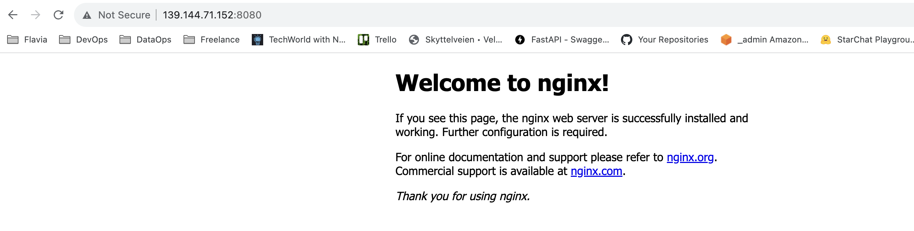
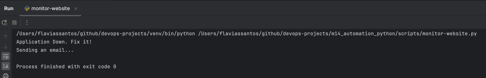
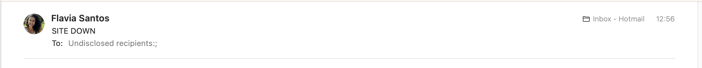
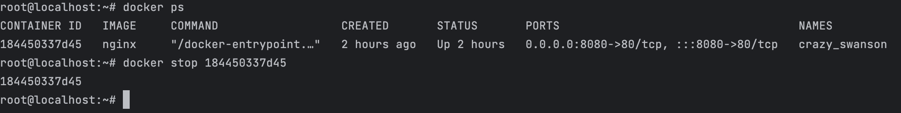
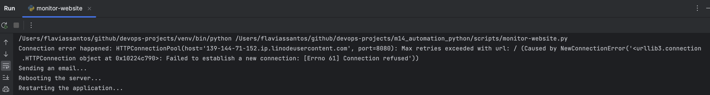
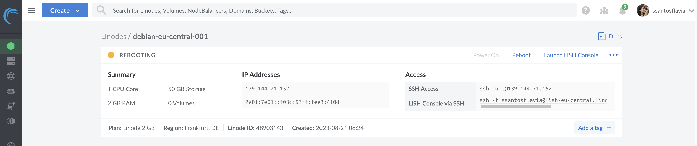

# Capstone Project 6: Website Monitoring and Recovery

#### Technologies used:

Python, Linode, Docker, Linux

---

## Project Description:

1. **Server and Nginx Setup:**
   I created a Linode server, installed Docker and ran an Nginx container, making a simple website accessible.

2. **Monitoring:**
   Aa Python script using the 'requests' library to monitor the website's status, checking for a '200' status code.

3. **Automation and Issue Resolution:**
   I planned to run the script periodically, send email alerts for issues, and automate remediation by restarting the container or server as needed.

---

## Project Execution:

Create a server on a cloud platform

Install Docker and run a Docker container on the remote server

Write a Python script that monitors the website by accessing it and validating the
HTTP response

Write a Python script that sends an email notification when website is down

❏ Preparation:

    ❏ Create Server on Linode
    ❏ Install Docker
    ❏ Run nginx container

```
$ docker run -d -p 8080:80 nginx
```

❏ Validate Requests to nginx website

  

❏ Send email when Website is down (not HTTP Status 200 - OK)

    ❏ Write Python code
    ❏ Configuration for your email provider (e.g. Gmail)
    ❏ Configure Environment Variables for Credentials)

❏ Send email when connection error (exception) occurs

  

 

Write a Python script that automatically restarts the application & server when
the application is down



  


