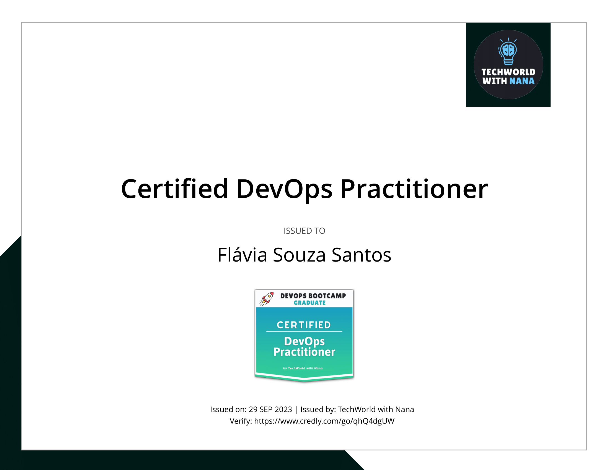

# DevOps Bootcamp Capstone Projects

 

This project demonstrates my ability to apply DevOps principles and best practices to real-world scenarios. I have designed and built a DevOps pipeline that integrates these various tools and concepts, showcasing my proficiency in orchestrating a seamless and efficient development and deployment process.

Through this project, I aim to illustrate my competence in creating and managing cloud-based infrastructure, containerizing applications, automating tasks, and ensuring the reliability and scalability of software systems. Each section of this project corresponds to a specific area of DevOps expertise that I have acquired during the bootcamp.

I have covered a diverse range of subjects, including:

- **Cloud & Infrastructure as a Service Basics:** Understanding the fundamentals of cloud computing and Infrastructure as a Service (IaaS) models.

- **Artifact Repository Manager with Nexus:** Implementing Nexus as a repository manager to efficiently manage dependencies.

- **Containers with Docker:** Exploring Docker for containerization, facilitating application deployment and scaling.

- **Build Automation - CI/CD with Jenkins:** Setting up continuous integration and continuous deployment (CI/CD) pipelines with Jenkins for efficient software development and delivery.

- **AWS Services:** Harnessing the power of Amazon Web Services (AWS) for cloud-based solutions and services.

- **Container Orchestration with Kubernetes:** Gaining expertise in container orchestration through Kubernetes.

- **Kubernetes on AWS - EKS:** Deploying and managing Kubernetes clusters on AWS using Amazon Elastic Kubernetes Service (EKS).

- **Infrastructure as Code with Terraform:** Leveraging Terraform to define and provision infrastructure as code.

- **Programming with Python:** Utilizing Python for scripting and automation.

- **Automation with Python:** Harnessing the power of Python for automating tasks and processes.

- **Configuration Management with Ansible:** Implementing Ansible for configuration management and automation of infrastructure.

- **Monitoring with Prometheus:** Setting up monitoring solutions using Prometheus to ensure the reliability and performance of applications and systems.

---

## Topics Learned in the Bootcamp

1. Introduction to DevOps 

- DevOps Bootcamp Overview 
- What is DevOps? 
- Roles and Responsibilities of a DevOps Engineer 
- How DevOps fits in the whole Software Development lifecycle 

2. Operating Systems & Linux Basics 

Introduction to Operating Systems 

- What is an OS and how does it work? 
- Tasks of an OS 
- How an OS is constructed 
- How different OSs, like Unix, Linux, Windows and MacOS differ from each other 

Virtualization 

- Introduction to Virtual Machine 
- Setup a Linux Virtual Machine 

Package Manager - Installing Software 

- What is a Package Manager and what are Software Repositories? 
- Learn all the options of installing software on Linux and how it all actually works in the background: 
- APT 
- APT vs APT-GET 
- SNAP 
- Ubuntu Software Center 
- YUM 

Working with Vim Editor 

- What is Vim? 
- Learn most important Vim Commands to work with Vim efficiently 

Users & Permissions 

- Linux Accounts 
- Users, Groups & Permissions 
- User Management in Practice 
- File Ownership & Permissions 
- Modifying Permissions 

Linux File System 

Basic Linux Commands 

- Introduction to Command Line Interface 
- Learn all the essential Linux Commands like 
- Directory Operations 
- Navigating the Files System 
- Work with the File System (Create folders, list files, rename, remove files etc.) 
- Execute Commands as Superuser 
- Pipes, Redirects, Less, Grep 

Shell Scripting 

- Shell vs sh vs Bash 
- Write & execute a simple script 
- Learn how to write Bash Scripts 
- Variables 
- Conditional Statements 
- Basic Operators 
- Passing Arguments to a Script to make it customizable and reusable 
- Read user input 
- Repeating code with shell loops 
- Functions 

Environment Variables 

- What are environment variables and how to access them 
- Create, Delete and Persist Env Variables 
- Understand what the PATH env variables is 

Networking 

- How computer networks work? 
- What is LAN, Switch, Router, Subnet, Firewall, Gateway 
- What is an IP address and port? 
- What is a DNS and how does DNS resolution work? 
- Useful Networking Commands 

SSH - Secure Shell 

- What is SSH and how it works 
- SSH in Action: 
- Create Remote Server on Cloud 
- Generate SSH Key Pair 
- Execute a bash script on a remote machine 

4. Build & Package Manager Tools 

* What are Build Tools and Package Managers?
* How to build an artifact?
* How to run the application artifact?
* How to publish the application artifact to artifact repository?
* Build Tools for Java (gradle and maven examples)
* Dependency Management in Software Development
* Package Manager in JavaScript applications - Build and run applications in JS
* Build Tools & Docker
* Why Build Tools are relevant for DevOps Engineers? 

5. Cloud & Infrastructure as a Service Concepts 

Working with a cloud server: 

- Setup Server on DigitalOcean (Droplet) 
- Install Java on Cloud Server 
- Deploy and run an application on Cloud Server 
- Create a Linux User to login to Server (instead of using Root User)

6. Artifact Repository Manager with Nexus

* What is an Artifact Repository Manager?
* Install and run Nexus on Cloud Server
* Different Repository Types (proxy, hosted, etc.) explained
* Different Repository Formats (maven, docker, npm, etc.) explained
* Upload Jar File to Nexus (maven and gradle projects)
* Nexus API and Repository URLs
* Blob stores
* Browsing Components - Components vs Assets
* Cleanup Policies
* Scheduled Tasks 

7. Containers with Docker 

- What is a Container? 
- Docker Components and architecture explained 
- Docker vs. Virtual Machine 
- Main Docker Commands 
- Debugging a Docker Container 
- Demo Project Overview - Docker in Practice (Nodejs App with MongoDB and MongoExpress UI) 
- Developing with Containers 
- Docker Compose - Running multiple services 
- Dockerfile - Building our own Docker Image 
- Private Docker Repository - Pushing our built Docker Image into a private Registry on AWS 
- Deploy containerized app 
- Docker Volumes - Persist data in Docker 
- Volumes Demo - Configure persistence for our demo project 
- Docker Best Practices 

Docker & Nexus 

- Create Docker Images Repository on Nexus 
- Push/Pull Docker Image from/to Nexus Repository Manager 
- Install Nexus with Docker 
- Configure insecure repositories in Docker Engine 

8. Build Automation - CI/CD with Jenkins 

- What is Build Automation? What is Jenkins? 
- Install Jenkins on cloud server (Docker vs Server install) 
- Jenkins plugins 
- Installing build tools in Jenkins 
- Jenkins Basics Demo 
  - Create Freestyle Job 
  - Configure Git Repository 
  - Run Tests and Build Java Application 
- Docker in Jenkins 
  - Make Docker commands available in Jenkins 
  - Build Docker Image 
  - Push to DockerHub Repo 
  - Push to Nexus Repo 
- Jenkins Pipeline (Use Cases) 
- Create a simple Pipeline Job 
- Full Jenkinsfile Syntax Demo 
  - Create a full Pipeline Job 
  - Build Java App 
  - Build Docker Image 
  - Push to private DockerHub 
- Create a Multi-Branch Pipeline Job 
- Credentials in Jenkins 
- Jenkins Shared Library 
- WebHooks - Trigger Jenkins Jobs automatically 
- Versioning Application in Continuous Deployment 
  - Concepts of Versioning in Software Development 
  - Increment Application version from Jenkins Pipeline 
  - Set new Docker Image version from Jenkins Pipeline 
  - Commit Version Bump from Jenkins Pipeline 

9. AWS Services 

- Introduction to Amazon Web Services 
- Identity & Access Management (IAM) - User, Groups and Permissions 
- Regions and Availability Zones 
- Virtual Private Cloud (VPC) - Your Private Network 
- Subnets 
- Security Groups 
- Internet Gateway 
- Route Table 
- CIDR Blocks 
- Introduction to Elastic Compute Cloud (EC2) 
- Create an EC2 Instance 
- Run Webapplication on EC2 using Docker 
- AWS Command Line Tool 
- Install and configure AWS CLI 
- Create EC2 
- Create Security Group 
- Create key-pair 
- Create IAM user with permissions 

AWS & Jenkins - Continuous Deployment with Jenkins to AWS EC2 

- Automate deploying from Jenkins Pipeline to EC2 Intance 
- using docker run 
- using docker-compose 
- Real-life example of dynamically setting new image version in docker-compose 
- SSH agent plugin and SSH credential type in Jenkins 

10. Introduction to Kubernetes 
- Understand the main Kubernetes Components 
  - Node, Pod, Service, Ingress, ConfigMap, Secret, Volume, Deployment, StatefulSet 
- Kubernetes Architecture 
- Minikube and kubectl - Local Setup 
- Main Kubectl Commands - K8s CLI 
- Create and debug Pod in a Minicluster 
- Kubernetes YAML Configuration File 
  - Create and Configure Deployment and Service Component 
- Demo Project: MongoDB and MongoExpress 
- Organizing your components with K8s Namespaces 
- Kubernetes Service Types 
- Making your App accessible from outside with Kubernetes Ingress 
- Persisting Data in Kubernetes with Volumes 
  - Persistent Volume 
  - Persistent Volume Claim 
  - Storage Class 
- ConfigMap and Secret Kubernetes Volume Types 
- Deploying Stateful Apps with StatefulSet 
- Deploying Kubernetes cluster on a Managed Kubernetes Service (K8s on Cloud) 
- Helm - Package Manager of Kubernetes 
- Helm Demo: Install a Stateful Application on Kubernetes using Helm 
- Demo: Deploy App from Private Docker Registry 
- Extending the Kubernetes API with Operator 
- Prometheus Operator Demo with Helm: Setup Prometheus Monitoring in K8s 
- Secure your cluster - Authorization with Role Based Access Control (RBAC) 

Microservices in Kubernetes 

- Introduction to Microservices 
- Demo project: Deploy Microservices Application 
- Demo project: Create common Helm Chart for Microservices 
- Demo project: Deploy Microservices with helmfile 
- Production & Security Best Practices 

11. Kubernetes on AWS - EKS 

AWS & Kubernetes 

- AWS Container Services: Overview (ECR, ECS, EKS, Fargate) 
  - Create an EKS cluster with AWS Management Console (UI) 
  - Create cluster VPC 
  - Create cluster Roles 
  - Use Cloudformation Stack 
  - EC2 Worker Nodes 
  - Fargate Profile 
  - Configure Austoscaler 
  - Configure kube context to connect to the cluster 
- Create an EKS cluster with eksctl (the easy way) 

AWS & Kubernetes & Jenkins & Docker - CI/CD 

- Configure kubectl inside Jenkins 
- Configure kube context in Jenkins 
- Install aws-iam-authenticator in Jenkins 
- Complete Jenkins Pipeline - Deploy to EKS - using kubectl 
- Complete Jenkins Pipeline - Build and push docker image to ECR and deploy to EKS 
- Complete Jenkins Pipeline - Deploy to LKE using Kubernetes CLI plugin and kubeconfig file 

12. Infrastructure as Code with Terraform 
- What is Terraform? How it works 
- Architecture 
- Providers 
- Resources & Data Sources 
- Variables & Output Values 
- Environment variables in Terraform 
- Terraform commands 
- Terraform State 
- Provisioners 
- Modules 
- Remote State 

Terraform & AWS 

- Create Security Group 
- Create VPC 
- Create Subnet 
- Create Route Table 
- Create Internet Gateway 
- Create key-pair 
- Provision EC2 server 
- Modularize the demo project 

Terraform & AWS & Kubernetes 

- Use existing modules from Terraform Registry 
- Create VPC 
- Provision EKS cluster 

Terraform & AWS & Jenkins - complete CI/CD 

- Configure Terraform in Jenkins 
- Automate provisioning EC2 instance from Jenkins pipeline and deploy the application with docker-compose 
- Terraform Best Practices 

14. Automation with Python 

Cloud Automation - AWS & Python 

- Introduction to Boto (AWS Library for Python) 
- Install Boto3 and connect to AWS 
- Getting familiar with Boto Library 
- Automate creating VPC and Subnets 
- Terraform vs Python - understand the differences and when to use which tool 

Automation Tasks around EC2 Instance: 

- Health Check: Automatically check the status of EC2 Instances 
- Scheduler: Write a scheduled task that executes the status check in a specified interval automatically 
- Configure Server: Automate adding tags to EC2 Instances with the environment label 
- Automate getting cluster information from all EKS clusters in your AWS account 

Automation Tasks around Data Backup & Restore 

- Backup EC2 Instances: Automate creating snapshots of EC2 Volumes 
- Cleanup Task: Write a cleanup script to automate cleanup of old EC2 snapshots 
- Restore EC2 Volume: Write a program to restore an EC2 volume with the backup snapshot and attach it to the EC2 Instance 

Automation Tasks around Website Monitoring (without AWS) 

- Monitoring: Write a scheduled automation program that monitors the website's health 
- E-Mail Notification: Configure python program to automatically send an email every time the website or server is down 
- Recover: Restart the application and reboot the underlying remote server 

15. Configuration Management with Ansible 

Core Concepts and Syntax of Ansible 

- Introduction to Ansible 
- Install & Configure Ansible 
- Setup Managed Server to configure with Ansible 
- Ansible Inventory 
- Ansible ad-hoc Commands 
- Configure AWS EC2 server with Ansible 
- Managing Host Key Checking and SSH keys 
- Ansible Tasks, Play & Playbook 
- Ansible Modules 
- Ansible Collections & Ansible Galaxy 
- Ansible Variables - to make your Playbook customizable 
- Troubleshooting in Ansible 
- Conditionals 
- Privilege Escalation 
- Ansible Configuration - Default Inventory File 

Learn most common Ansible modules with hands-on demos: 

- Project: Deploy Nodejs Application 
- Project: Deploy Nexus 
- Configure servers with different Linux distributions on AWS and Digital Ocean platforms 

More Advanced Topics & Integrations with other Technologies 

- Dynamic Inventory for EC2 Servers 
- Ansible Roles - to make your Ansible content more reusable and modular for better maintenance 
- Project: Ansible & Terraform 
- Project: Run Docker applications 
- Project: Deploying Applications in Kubernetes 
- Project: Run Ansible from Jenkins Pipeline 

16. Monitoring with Prometheus 
- Introduction to Monitoring with Prometheus 
- Install Prometheus Stack in Kubernetes 
- Data Visualization with Prometheus UI 
- Introduction to Grafana 
- Alert Rules in Prometheus 
- Create own Alert Rules 
- Introduction to Alertmanager 
- Configure Alertmanager with Email Receiver 
- Trigger Alerts for Email Receiver 
- Monitor Third-Party Applications 
- Deploy Redis Exporter 
- Alert Rules & Grafana Dashboard for Redis 
- Collect & Expose Metrics with Prometheus Client Library 
- Scrape Own Application Metrics & Configure Own Grafana Dashboard
